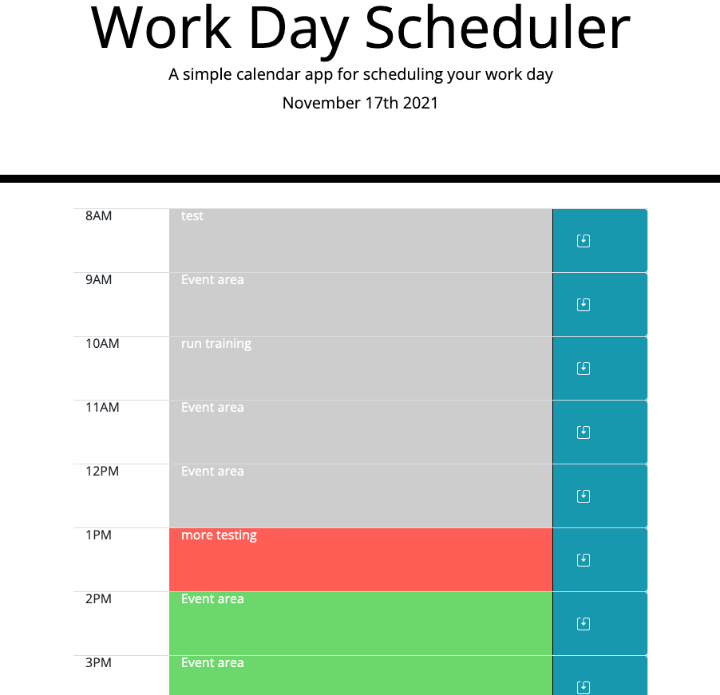

# Work Day Scheduler

##Purpose
This was built to give users a place to schedule their day out and keep an eye on the tasks and where they are at in the day for their schedule. 

##Link
Link to site can be found [here](https://grsmith35.github.io/scheduler/).

##Languages
Javascript
Jquery
CSS
HTML

##Image
Here is what the final product looks like.

##Struggles
The biggest struggle on this was pulling the text from the event field, so many times i was close but just missing one small thing. 
